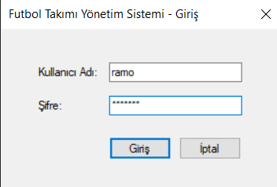
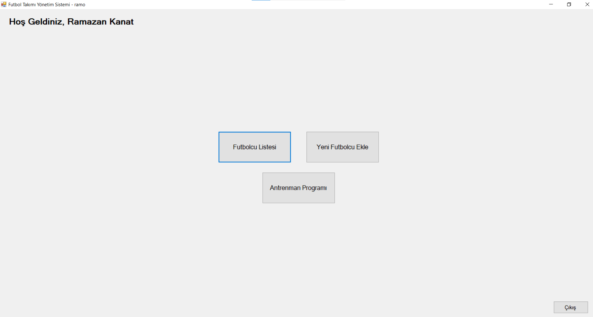
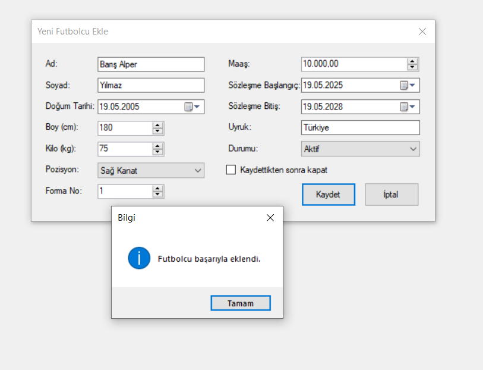
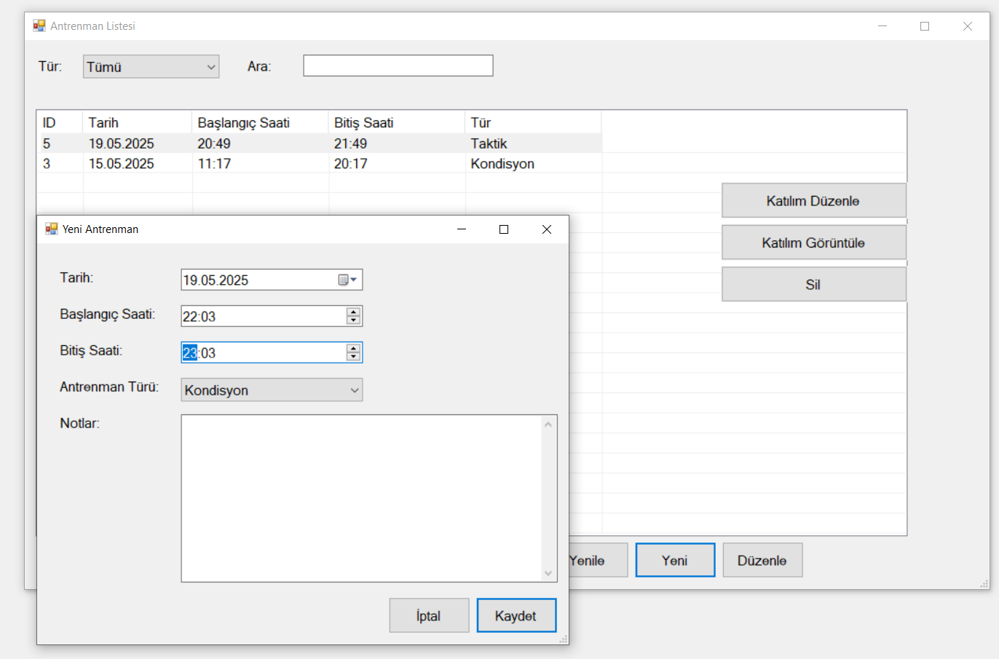
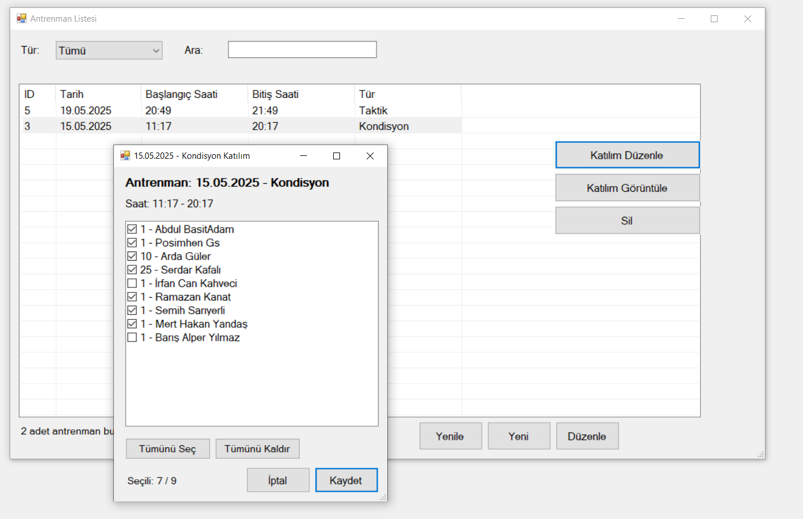

# ⚽ Futbol Takımı Yönetim Sistemi


[](https://choosealicense.com/licenses/mit/)

Profesyonel futbol takımlarının günlük operasyonlarını yönetmek için geliştirilmiş, güvenli ve ölçeklenebilir bir Windows Forms uygulaması. PostgreSQL veritabanı altyapısı ile çalışır.

---

## 🎯 Proje Özellikleri

### ✨ Temel Özellikler
- ✅ **Futbolcu Yönetimi:** Tam CRUD işlemleri (Ekleme, Güncelleme, Silme, Listeleme)
- ✅ **Antrenman Takibi:** Antrenman planlaması ve katılım yönetimi
- ✅ **Performans İzleme:** Futbolcu performans raporları ve istatistikleri
- ✅ **Çoklu Kullanıcı Desteği:** Yönetici ve Antrenör rolleri
- ✅ **Gelişmiş Arama:** İsim, pozisyon ve duruma göre filtreleme
- ✅ **Sözleşme Takibi:** Otomatik sözleşme bitiş uyarıları

### 🔐 Güvenlik Özellikleri
- ✅ **BCrypt Şifreleme:** Güvenli şifre hash'leme
- ✅ **SQL Injection Koruması:** Parametreli sorgular ve stored procedures
- ✅ **Session Yönetimi:** Güvenli oturum kontrolü
- ✅ **Rol Tabanlı Yetkilendirme:** Kullanıcı tipine göre erişim kontrolü
- ✅ **Audit Logging:** Tüm işlemlerin kayıt altına alınması

### 🏗️ Teknik Altyapı
- **C#** ve **.NET Framework 4.7.2**
- **PostgreSQL 14+** veritabanı
- **Npgsql 8.0.5** - PostgreSQL .NET bağlantısı
- **BCrypt.Net-Next 4.0.3** - Şifre güvenliği
- **Windows Forms** - Kullanıcı arayüzü
- **Stored Procedures** (10 adet) - Veritabanı iş mantığı
- **Triggers** (4 adet) - Otomatik log ve uyarılar

---

## 📊 Veritabanı Mimarisi

### Tablolar (7 adet)
- **Yoneticiler** - Yönetici kullanıcılar
- **Antrenorler** - Antrenör kullanıcılar (2. kullanıcı tipi)
- **Futbolcular** - Futbolcu bilgileri
- **Antrenmanlar** - Antrenman planları
- **FutbolcuAntrenman** - Katılım ve performans kayıtları
- **LogTablosu** - İşlem logları (audit trail)
- **Bildirimler** - Sistem bildirimleri

### Stored Procedures (10 adet)
```sql
sp_futbolcu_ekle              -- Futbolcu ekleme
sp_futbolcu_guncelle          -- Futbolcu güncelleme
sp_futbolcu_sil               -- Futbolcu silme
sp_futbolcu_listele           -- Futbolcu listeleme
sp_antrenman_ekle             -- Antrenman oluşturma
sp_katilim_ekle               -- Katılım kaydetme
sp_yonetici_giris             -- Yönetici giriş kontrolü
sp_antrenor_giris             -- Antrenör giriş kontrolü
sp_performans_raporu          -- Performans raporlama
sp_sozlesme_biten_futbolcular -- Sözleşme takibi
```

### Triggers (4 adet)
- **trg_futbolcu_insert** - Ekleme logu
- **trg_futbolcu_update** - Güncelleme logu
- **trg_futbolcu_delete** - Silme logu
- **trg_sozlesme_uyari** - Sözleşme bitiş uyarısı (90 gün önceden)

### Normalizasyon
- ✅ **3NF (Third Normal Form)** standartlarına uygun
- ✅ Foreign key ilişkileri
- ✅ Cascade delete desteği
- ✅ 13 performans index'i

---

## 📷 Ekran Görüntüleri

### Giriş Ekranı

*Yönetici ve Antrenör girişleri*

### Ana Panel

*Futbolcu listesi ve yönetim paneli*

### Futbolcu Yönetimi

*Detaylı futbolcu bilgileri formu*

### Antrenman Yönetimi

*Antrenman planlama ekranı*

### Performans Takibi

*Katılım ve performans kayıt ekranı*

---

## 🚀 Kurulum

### Gereksinimler
- **Windows** 10/11
- **.NET Framework** 4.7.2 veya üzeri
- **PostgreSQL** 14 veya üzeri
- **Visual Studio** 2019/2022 (geliştirme için)

### Adım 1: PostgreSQL Kurulumu

```bash
# PostgreSQL'i indirin ve kurun
https://www.postgresql.org/download/windows/

# Kurulum sırasında:
- Port: 5432 (varsayılan)
- Superuser (postgres) şifresini belirleyin
```

### Adım 2: Veritabanı Oluşturma

1. **pgAdmin 4** uygulamasını açın
2. **PostgreSQL 14** sunucusuna bağlanın
3. Sağ tık: **Databases** > **Create** > **Database**
4. Database adı: `futbol_takimi_db`
5. **Save** butonuna tıklayın

### Adım 3: Şema Yükleme

**Yöntem 1: Tek Dosya ile Tam Kurulum (Önerilen)**
```sql
-- pgAdmin > futbol_takimi_db > Query Tool
-- File > Open: Database/Schema/00_TumKurulum_Full.sql
-- Execute (F5)
-- ~30 saniye bekleyin
```

**Yöntem 2: Adım Adım Kurulum**
```sql
-- Sırasıyla çalıştırın:
1. Database/Schema/01_Tables.sql
2. Database/Schema/02_Indexes.sql
3. Database/Schema/03_Constraints.sql
4. Database/Schema/04_InitialData.sql
```

### Adım 4: Proje Yapılandırma

1. **Projeyi klonlayın:**
   ```bash
   git clone https://github.com/ramazankanat226/Futbol-Takimi-Yonetim-Sistemi.git
   cd Futbol-Takimi-Yonetim-Sistemi/FutbolTakimiYonetimSistemi
   ```

2. **App.config dosyasını oluşturun:**
   ```bash
   copy App.config.example App.config
   ```

3. **App.config'i düzenleyin:**
   ```xml
   <add name="FutbolTakimiDB" 
        connectionString="Host=localhost;Port=5432;Database=futbol_takimi_db;Username=postgres;Password=BURAYA_SİFRENİZİ_GİRİN;Pooling=true;" />
   ```

4. **Visual Studio ile açın:**
   ```
   FutbolTakimiYonetimSistemi.sln
   ```

5. **NuGet paketlerini geri yükleyin:**
   ```
   Tools > NuGet Package Manager > Restore NuGet Packages
   ```

6. **Projeyi derleyin:**
   ```
   Build > Rebuild Solution
   ```

7. **Çalıştırın:**
   ```
   Debug > Start Debugging (F5)
   ```

---

## 📝 Kullanım

### Test Kullanıcıları

| Kullanıcı Tipi | Kullanıcı Adı | Şifre | Yetkiler |
|----------------|---------------|-------|----------|
| **Yönetici** | semih | semih123 | Tam yetki (CRUD + Raporlar) |
| **Antrenör** | ramazan | ramazan123 | Antrenman + Performans |

### Yönetici Paneli
1. **Futbolcu Yönetimi**
   - Yeni futbolcu ekleme
   - Mevcut kayıtları düzenleme
   - Futbolcu silme
   - Gelişmiş arama ve filtreleme

2. **Antrenman Yönetimi**
   - Antrenman planlaması
   - Katılımcı ekleme
   - Performans girişi

3. **Raporlama**
   - Futbolcu performans raporları
   - Katılım istatistikleri
   - Sözleşme takibi

### Antrenör Paneli
1. **Antrenman Oluşturma**
   - Tarih ve saat belirleme
   - Antrenman türü seçimi
   - Not ekleme

2. **Performans Takibi**
   - Katılım işaretleme
   - Performans puanlama (1-10)
   - Gözlem notları

---

## 🏗️ Proje Yapısı

```
FutbolTakimiYonetimSistemi/
│
├── Data/                          # Veritabanı katmanı
│   └── DatabaseHelper.cs          # PostgreSQL bağlantı yönetimi
│
├── Models/                        # Veri modelleri
│   ├── Futbolcu.cs
│   ├── Antrenman.cs
│   ├── FutbolcuAntrenman.cs
│   ├── Yonetici.cs
│   └── Antrenor.cs
│
├── Services/                      # İş mantığı katmanı
│   ├── FutbolcuService.cs         # Futbolcu CRUD işlemleri
│   ├── AntrenmanService.cs        # Antrenman işlemleri
│   ├── FutbolcuAntrenmanService.cs
│   ├── YoneticiService.cs         # Yönetici giriş
│   └── AntrenorService.cs         # Antrenör giriş
│
├── Forms/                         # Kullanıcı arayüzü
│   ├── GirisForm.cs               # Giriş ekranı
│   ├── AnaForm.cs                 # Ana panel
│   ├── FutbolcuListesiForm.cs
│   ├── FutbolcuEditForm.cs
│   ├── AntrenmanListesiForm.cs
│   ├── AntrenmanEditForm.cs
│   ├── AntrenmanKatilimForm.cs
│   └── AntrenmanKatilimGoruntuleForm.cs
│
├── Utils/                         # Yardımcı sınıflar
│   ├── PasswordHelper.cs          # BCrypt şifreleme
│   ├── SessionManager.cs          # Oturum yönetimi
│   └── ValidationHelper.cs        # Veri doğrulama
│
├── Exceptions/                    # Özel exception'lar
│   └── BusinessException.cs
│
├── Database/                      # SQL scriptleri
│   ├── Schema/                    # Tablo yapıları
│   │   ├── 00_TumKurulum_Full.sql
│   │   ├── 01_Tables.sql
│   │   ├── 02_Indexes.sql
│   │   ├── 03_Constraints.sql
│   │   └── 04_InitialData.sql
│   ├── StoredProcedures/          # 10 adet SP
│   └── Triggers/                  # 4 adet trigger
│
├── App.config.example             # Yapılandırma template
└── FutbolTakimiYonetimSistemi.csproj
```

---

## 🔒 Güvenlik

### Uygulanan Güvenlik Önlemleri

1. **Şifre Güvenliği**
   - BCrypt hash algoritması (work factor: 11)
   - Salt otomatik ekleniyor
   - Brute force koruması

2. **SQL Injection Koruması**
   - Parametreli sorgular
   - Stored procedure kullanımı
   - Input validasyonu

3. **Session Güvenliği**
   - Singleton pattern ile merkezi yönetim
   - Oturum timeout (60 dakika)
   - Rol tabanlı yetkilendirme

4. **Audit Trail**
   - Tüm CRUD işlemleri loglanıyor
   - Kullanıcı ve işlem zamanı kaydediliyor
   - JSONB formatında veri tutulması

### Güvenlik Önerileri

⚠️ **Üretim Ortamı İçin:**
- Varsayılan şifreleri mutlaka değiştirin
- `App.config` dosyasını Git'e eklemeyin
- PostgreSQL'de güçlü şifreler kullanın
- Düzenli veritabanı yedeği alın
- Connection string'i şifreleyin (ASP.NET için)

---

## 🧪 Test

### Test Senaryoları

1. **Veritabanı Bağlantı Testi**
   ```sql
   SELECT * FROM sp_futbolcu_listele();
   ```

2. **Kullanıcı Giriş Testi**
   ```sql
   SELECT * FROM sp_yonetici_giris('semih', 'semih123');
   SELECT * FROM sp_antrenor_giris('ramazan', 'ramazan123');
   ```

3. **CRUD İşlem Testi**
   ```sql
   -- Futbolcu ekle
   SELECT sp_futbolcu_ekle('Test', 'Futbolcu', '2000-01-01', 180, 75, 
                            'Orta Saha', 99, 50000, '2024-01-01', 
                            '2025-12-31', 'Türkiye', 'Aktif');
   
   -- Listele
   SELECT * FROM Futbolcular WHERE FormaNo = 99;
   
   -- Sil
   SELECT sp_futbolcu_sil(LAST_INSERT_ID);
   ```

---

## 📚 Dokümantasyon

- **[Database README](Database/README_DATABASE.md)** - Veritabanı kurulum kılavuzu
- **[Config README](FutbolTakimiYonetimSistemi/README_CONFIG.md)** - Yapılandırma kılavuzu
- **[Stored Procedures](Database/StoredProcedures/README.md)** - SP dokümantasyonu
- **[Triggers](Database/Triggers/README.md)** - Trigger dokümantasyonu
- **[CONTRIBUTING](CONTRIBUTING.md)** - Katkıda bulunma rehberi

---

## 🛠️ Sorun Giderme

### "Connection Failed" Hatası
```bash
# PostgreSQL servisini kontrol edin
services.msc > postgresql-x64-14 > Start

# Veritabanı var mı kontrol edin
psql -U postgres -l | grep futbol_takimi_db

# Şifre doğru mu test edin
psql -U postgres -d futbol_takimi_db
```

### "Npgsql.dll Bulunamadı"
```bash
# Visual Studio'da
Tools > NuGet Package Manager > Package Manager Console
Update-Package Npgsql
```

### "Stored Procedure Bulunamadı"
```sql
-- pgAdmin'de kontrol edin
SELECT routine_name 
FROM information_schema.routines 
WHERE routine_schema = 'public';

-- Yoksa tekrar yükleyin
-- Database/Schema/00_TumKurulum_Full.sql
```

---

## 🤝 Katkıda Bulunma

Katkılarınızı bekliyoruz! Lütfen [CONTRIBUTING.md](CONTRIBUTING.md) dosyasını inceleyin.

1. Projeyi fork edin
2. Feature branch oluşturun (`git checkout -b feature/amazing-feature`)
3. Değişikliklerinizi commit edin (`git commit -m 'Add amazing feature'`)
4. Branch'e push edin (`git push origin feature/amazing-feature`)
5. Pull Request açın

---

## 📄 Lisans

Bu proje [MIT Lisansı](LICENSE) altında lisanslanmıştır.

---

## 👥 Geliştirici

**Ramazan Kanat**
- GitHub: [@ramazankanat226](https://github.com/ramazankanat226)

---

## 📞 İletişim ve Destek

- **Issues:** [GitHub Issues](https://github.com/ramazankanat226/Futbol-Takimi-Yonetim-Sistemi/issues)
- **Pull Requests:** [GitHub Pull Requests](https://github.com/ramazankanat226/Futbol-Takimi-Yonetim-Sistemi/pulls)

---

## 🎓 Akademik Kullanım

Bu proje aşağıdaki akademik gereksinimleri karşılamaktadır:
- ✅ C# programlama dili
- ✅ PostgreSQL veritabanı
- ✅ En az 3 nesne için CRUD işlemleri
- ✅ Stored Procedure kullanımı (10 adet)
- ✅ Trigger kullanımı (4 adet)
- ✅ 3NF normalizasyonu
- ✅ 2 farklı kullanıcı tipi (Yönetici + Antrenör)
- ✅ Kullanıcı giriş paneli
- ✅ Grafik arayüz ile veritabanı işlemleri

---

## 📊 İstatistikler

- **Toplam Kod Satırı:** ~2,500+
- **Tablo Sayısı:** 7
- **Stored Procedure:** 10
- **Trigger:** 4
- **Index:** 13
- **Form Sayısı:** 8
- **Model Sayısı:** 5
- **Service Sınıfı:** 5

---

<div align="center">

**⚽ Futbol Takımı Yönetim Sistemi**  
*Profesyonel takım yönetimi için güvenilir çözüm*

**[⭐ Star](https://github.com/ramazankanat226/Futbol-Takimi-Yonetim-Sistemi) | [🐛 Issue](https://github.com/ramazankanat226/Futbol-Takimi-Yonetim-Sistemi/issues) | [📖 Docs](Database/README_DATABASE.md)**

---

**Versiyon 2.0** | Son Güncelleme: Aralık 2024

</div>
